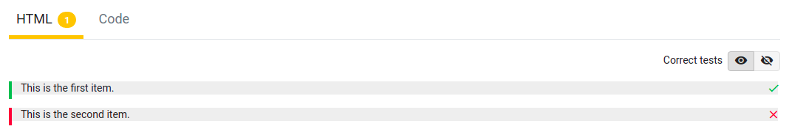

# ChecklistItem Class

`ChecklistItem`s, as the name suggests, represent items on the checklist. This contains a message that will be displayed to the user, and all checks that will run behind the scenes. All of these checks have to pass in order to mark this item as correct. These can either be passed in one by one (as `varargs`) or in a `List` of `Checks`. Both options will work.

There is **no** message telling the user which checks failed, as this would allow them to slowly puzzle the solution together. The only message they can see is the one you pass into the ChecklistItem when creating it. The image below shows what this would look like on Dodona:

```python
item_1 = ChecklistItem("This is the first item.", check1)
item_2 = ChecklistItem("This is the second item.", check2, check3, ...)
```


