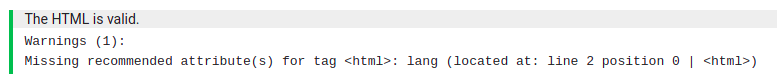

# TestSuite Class

A `TestSuite` contains a checklist of all checks that should be performed on the student's code. An exercise is only marked as correct once every check in every TestSuite has passed.

## Table of Contents
- [Attributes](#attributes)
- [TestSuites on Dodona](#testsuites-on-dodona)
- [Referencing (specific) HTML elements](#referencing-specific-html-elements)
- [Adding checks](#adding-checks)
- [Built-in Checks](#built-in-checks)
    - [validate_html](#validate_html)
    - [document_matches](#document_matches)

## Attributes

| name | description | required | default |
:------|:------------|:--------:|:--------|
| name | The name of this TestSuite, used as the name of the Tab on Dodona (see [TestSuites on Dodona](#testsuites-on-dodona)) | X | |
| content | A string that contains the student's submission. This is passed as an argument into the `create_suites` method. | X | |
| check_recommended | <a id="check-recommended-image"/> A boolean that indicates if the student should see warnings about missing recommended attributes.<br /><br /> These warnings do **not** cause their submission to be marked incorrect, and are purely informational.<br /><br /> | | True |

## TestSuites on Dodona

TestSuites are displayed as `tabs` on Dodona, and the `name` attribute will be the name of the tab. The names can be whatever you want them to be, but the examples here will always use "HTML" and "CSS" for consistency. The image below shows what this would look like for two suites named `HTML` and `CSS`:

```python
from validators.checks import TestSuite

def create_suites(content: str):
    html_suite = TestSuite("HTML", content)
    css_suite = TestSuite("CSS", content)
    return [html_suite, css_suite]
```


The image also shows a `1` next to the `HTML` tab, indicating that 1 test failed. This instantly allows users to see which part of their code caused the exercise to be incorrect, and which parts are already finished.

## Referencing (specific) HTML elements

You can get a specific HTML element by tag using `suite.element(tag)` in the form of an instance of the `Element` class (explained later). Afterwards, you can use this reference to create extra checks based off of it.

The example below shows how to get the `<html>` tag:

```html
<html lang="en">
    <body>
        ...
    </body>
</html>
```

```python
suite = TestSuite("HTML", content)
html_tag = suite.element("html")
```

Searching will start from the root element, and work in a breadth-first way recursively. In case you want to disable this and only search the root of the tree, you can pass `from_root=True` into the function.

The example below shows how to get the `<div>` at the root of the tree, and not the one that comes first in the file but is nested deeper.

```html
<span>
    <!-- We don't want this div -->
    <div>
        ...
    </div>
</span>
<!-- We want THIS div -->
<div>
    ...
</div>
```

```python
suite = TestSuite("HTML", content)
root_div = suite.element("div", from_root=True)
```

Extra filters, such as id's and attributes, can be passed as `kwargs`. You can pass as many filters as you want to.

The example below shows how to get the `<tr>` with id "row_one", and the `<th>` with attribute `colspan` equal to `2`.

```html
<table>
    <!-- We don't want this tr -->
    <tr id="header">
        <!-- We don't want this th -->
        <th>Wrong Header</th>
        
        <!-- We want THIS th -->
        <th colspan="2">Correct Header</th>
    </tr>
     <!-- We want THIS tr -->
    <tr id="row_one">
        ...
    </tr>
</table>
```

```python
suite = TestSuite("HTML", content)
tr_one = suite.element("tr", id="row_one")
th_colspan = suite.element("th", colspan="2")
```

Remember that values should be `strings`.

In case an attribute only has to *exist*, and the value doesn't matter, set the value to `True`. In the example above, this would mean that you request the students have at least one `<th>` with a `colspan` attribute, no matter how big it may be. The code for this would be `suite.element("th", colspan=True)`

## Referencing multiple HTML elements

In case you want to get a list of all elements (optionally matching filters), use `suite.all_elements` instead. This method takes the exact same arguments as `elements`, and thus the same filters can be applied.

Note that this method returns an instance of `ElementContainer`, which can be used like a regular Python `list`:

More info on `ElementContainer`s can be found in the respective documentation page (TODO).

## Adding items to the checklist

In order to add ChecklistItems, you can either set the entire checklist at once, or add separate ChecklistItems one by one.

```python
suite = TestSuite("HTML", content)

first_item = ChecklistItem("Item 1", ...)
second_item = ChecklistItem("Item 2", ...)

# Directly setting the list content
suite.checklist = [first_item, second_item]

# Adding the items one by one
suite.checklist.append(first_item)
suite.checklist.append(second_item)
```

## Built-in Checks

The TestSuite class comes with a few Checks that you can use, and they are documented below. More Checks can be found in different classes.

### validate_html

Check that the student's submitted code is valid HTML without syntax errors. The errors will not be reported to the student as to not reveal the answer.

Signature:
```python
def validate_html(allow_warnings: bool = True) -> Check
```

<table>
    <caption>Parameters</caption>
    <tr>
        <th>name</th>
        <th>description</th>
        <th>required</th>
        <th>default</th>
    </tr>
    <tr>
        <td>allow_warnings</td>
        <td>Boolean that indicates that the check should <i>not</i> be marked incorrect if any warnings arise.</td>
        <td></td>
        <td>True</td>
    </tr>
</table>

In case the `check_recommended` attribute for this class is `True` (default), this will also show the student warnings about missing recommended attributes (see [Attributes](#check-recommended-image)).

Example usage:
```python
suite = TestSuite("HTML", content)
valid_html = ChecklistItem("The HTML is valid.", suite.validate_html())
```

### document_matches

Check that the student's submitted code matches a `regex string`.

Signature:
```python
def document_matches(self, regex: Pattern[AnyStr]) -> Check
```

<table>
    <caption>Parameters</caption>
    <tr>
        <th>name</th>
        <th>description</th>
        <th>required</th>
        <th>default</th>
    </tr>
    <tr>
        <td>regex</td>
        <td>The pattern to match the student's code against.</td>
        <td>X</td>
        <td></td>
    </tr>
</table>

Example usage:

```python
suite = TestSuite("HTML", content)

pattern = r".*<[^>]+/>.*"
valid_html = ChecklistItem("The document contains at least one self-closing tag.", suite.document_matches(pattern))
```