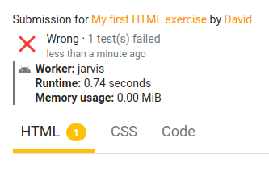

# Writing evaluators

The HTML judge comes with a custom testing framework to verify the code of your students.  This file (and the others in this directory) contain information and examples on how to write your own evaluators.

## Required format

All evaluators should follow a strict interface: the file should always be called `evaluator.py`, and in addition has to follow these rules:

- Contain a `create_suites` function
- This function should take a `string`, being the student's submission, and return a `list` of `TestSuite`s
- The `list` should contain **at least one** `TestSuite`
- The file should import `validators` directly, without any packages above it. To do this, we recommend placing the library at the `root` of your project in which you write the evaluators.

The fragment below contains the boilerplate to make an evaluator:

```python
from typing import List
from validators import checks


def create_suites(content: str) -> List[checks.TestSuite]:
    html_suite = checks.TestSuite("HTML", content)
    css_suite = checks.TestSuite("CSS", content)

    return [html_suite, css_suite]

```

In case you only want to write tests for either `HTML` or `CSS`, and not both, the other suite is not required. It is merely added in the fragment above as an example. Returning `[html_suite]` is equally valid.

## TestSuite class

A `TestSuite` contains a checklist of all checks that should be performed on the student's code. An exercise is only marked as correct once every check in every TestSuite has passed.

### TestSuites on Dodona

TestSuites are displayed as `tabs` on Dodona, and the `name` attribute will be the name of the tab. The image below shows what this would look like for two suites named `HTML` and `CSS`:

```python
from validators.checks import TestSuite

def create_suite(content: str):
    html_suite = TestSuite("HTML", content)
    css_suite = TestSuite("CSS", content)
    return [html_suite, css_suite]
```



The image also shows a `1` next to the `HTML` tab, indicating that 1 test failed. This instantly allows users to see which part of their code caused the exercise to be incorrect, and which parts are already finished.

### Adding checks

In order to add checks, you can either set the entire checklist at once, or add separate `ChecklistItem`s one by one.

```python
suite = TestSuite("HTML", content)

first_item = ChecklistItem("Item 1", ...)
second_item = ChecklistItem("Item 2", ...)

# Directly setting the list content
suite.checklist = [first_item, second_item]

# Adding the items one by one
suite.checklist.append(first_item)
suite.checklist.append(second_item)
```